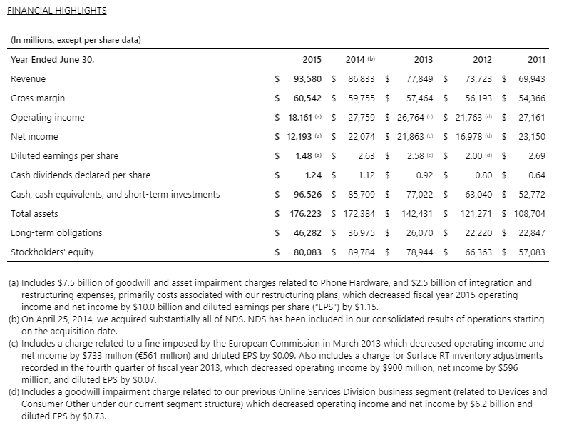

# Microsoft, a case study  - Frank Lau

​

## Overview and Origin
​
* Microsoft is an American technology company that develops computer software, personal computers, and the operating system Windows

* Microsoft was founded on April 4, 1975 by Bill Gates and Paul Allen initially to sell micro-software such as their BASIC interpreter, hence the name "*Microsoft.*"

* Microsoft eventually entered the operating system business, eventually creating a breakthrough known as "*MS-DOS*", and later "*Windows*" which laid the foundation of success.

* Dominating the operating system business with Microsoft Windows, Microsoft decided to go public in the stock market on March 13, 1986 with the ticker "*$MSFT*". The demand and rise in stock price would help Microsoft finance future company endeavors.

* An article on investment website [Benzinga](https://www.benzinga.com/general/education/21/06/21756652/if-you-invested-1-000-in-microsoft-at-its-ipo-heres-how-much-youd-have-now) states that as of 2021, if you had invested $1000 into $MSFT at the date of IPO, you would currently have $3,683,965, which is a return of 368,296.5%!

* In a period of rapid growth and upon the advent of the Internet, Microsoft decided to venture into Internet software, creating their own browser "*Internet Explorer*."

* However, all good things must come to an end. In the year 2000, Microsoft was faced with multiple emerging threats, the biggest of which was anti-trust laws.

* According to a [Brittanica](https://www.britannica.com/topic/Microsoft-Corporation) report, Microsoft was found in violation of the Sherman Antitrust Act and was forced to breakup.

* As a result, in the next few years, Microsoft was humble in expansion, instead, growing steadily through revenue gains by quietly dominating corporate business computing with it's Windows Servers, Microsoft Office, and SQL.
​
## Business Activities:
​
* Microsoft primary business activities lie in both B2B and B2C operations, they deal with both Enterprise solutions and sales to consumers
* Microsoft's advantage in this sector is Windows, the most used operating system in the world. Additionally their software such as the Microsoft Office 365 Suite (Excel, Word, Outlook, etc.) are subscription-based and are widely used in corporations and households around the globe. This intellectual property provides Microsoft a steady stream of annual revenue.

* Following a few quiet years in the early 2000's, Microsoft decided to venture into different product launches and capture market share in other sectors. Notable launches include the very successful Xbox 360 and Xbox Live online gaming subscription model, as well as their failure to rival Apple and grasp a foothold in the mobile phone industry with their disasterous reception of the Microsoft Zune and Kin.

* With the failure of their mobile products, in 2015, Microsoft decided to go through a period of financial restructuring.

[Exhibit 1](https://www.microsoft.com/investor/reports/ar15/index.html)

   * Exhibit 1 above comes from Microsoft's Official Investor Reports. As we can see, there is a huge dip in both operating income and net income for the fiscal year of 2015, about a $10 billion decrease.
   * This is a result of Microsoft partaking in major integration and restructuring plans to focus more on their more profitable brands and innovations, such as the upcoming heavy-hitter, Azure Cloud.

## Landscape:
​
* As Microsoft deals primarily in Enterprise Solutions, their most successful products have been a result of subscription-based models. 
​
* In the recent years, the latest breakthrough for Microsoft has been its recent Azure Cloud technology. As consumer trends push for ownership of multiple technological devices, providing a platform that provides ease of access and storage of user data between different devices is crucial for both corporations and individuals.
​
* In their [Fourth Quarter Report](https://news.microsoft.com/2021/07/27/microsoft-cloud-strength-fuels-fourth-quarter-results-2/), Microsoft announced that as of June 30, 2021, commercial cloud revenue grew a stunning 36% year over year, bringing in an annual revenue of $19.5 billion.

* Additionally in a report from [Reuters](https://www.reuters.com/technology/microsoft-beats-quarterly-revenue-estimates-2021-07-27/), Microsoft's Q4 report was their most profitable by far, beating Wall Street expectations and a 51% increase in sales.

* However, Microsoft is not without competition in the commercial cloud industry. Notable competitors include Amazon, Google, IBM, Oracle, Salesforce, and Alibaba.

[Exhibit 2](https://www.c-sharpcorner.com/article/top-10-cloud-service-providers/)

   * Exhibit 2 above displays Microsoft's market share in commercial cloud over the years in comparison to their competitors

## Results
​
* Microsoft's products have truly revolutionized the way the world conducts business. The Windows OS, Microsoft Office, and Azure cloud services have truly helped allow ease in performing tasks during this age of globalization. In the business and personal world, Microsoft's products are utilized daily.
​

[Exhibit 3](https://www.reuters.com/companies/MSFT.OQ/financials)

* To this day, Microsoft remains an absolute giant in the technological sector. Exhibit 3 above provided by Reuters show steady growth with an increase of net income of 25,489 million in 2017, to a staggering net income of 61,271 million in 2021.

​
## Recommendations
​
* Microsoft's products which follow mainly a subscription-based model provides Microsoft a huge amount of steady annual income. Personally, I believe that the current business model clearly works, and Microsoft should focus on improving their ongoing products instead of expanding towards another sector 
​
* My reccomendation for Microsoft would be to grow their Azure cloud services by making strategic partnerships with other companies that deal with data/analytics across the world. This would allow Microsoft to streamline bottlenecks and provide more efficient services.
​
* Additionally, Microsoft should invest more capital into upgrading their current cloud infrastructure such as building and upgrading their servers which would evolve their current services and help resolve outage/DNS issues such as the one reported in this particular [Reuters article](https://www.reuters.com/article/idUSKBN2BO6TK).
​
* Improving their current Azure services would help them increase market share and compete further with Amazon, who is currently the cloud industry king with their AWS technology.

### Sources:
1. https://en.wikipedia.org/wiki/Microsoft
2. https://www.britannica.com/topic/Microsoft-Corporation
3. https://www.benzinga.com/general/education/21/06/21756652/if-you-invested-1-000-in-microsoft-at-its-ipo-heres-how-much-youd-have-now
4. https://www.microsoft.com/investor/reports/ar15/index.html
5. https://news.microsoft.com/2021/07/27/microsoft-cloud-strength-fuels-fourth-quarter-results-2/
6. https://www.reuters.com/technology/microsoft-beats-quarterly-revenue-estimates-2021-07-27/
7. https://www.c-sharpcorner.com/article/top-10-cloud-service-providers/
8. https://www.reuters.com/article/idUSKBN2BO6TK
9. https://www.reuters.com/companies/MSFT.OQ/financials
